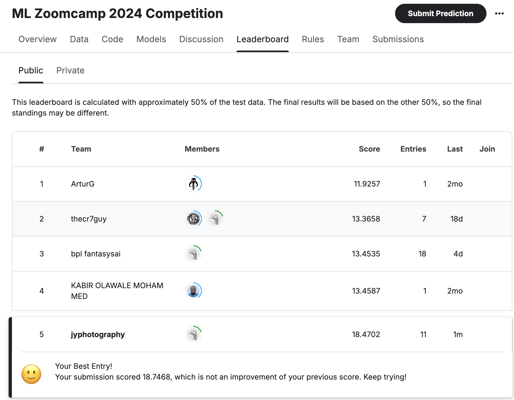
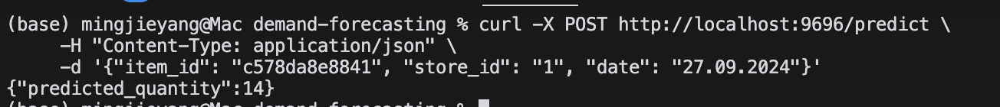

# Retail Demand Forecasting



## Overview
This project, developed as part of the [ML Zoomcamp 2024 Competition](https://www.kaggle.com/competitions/ml-zoomcamp-2024-competition/overview), implements a machine learning solution for predicting retail customer demand. The model achieved 5th place in the competition, demonstrating its effectiveness in forecasting sales across multiple stores using 25 months of historical data.

## Table of Contents
- [Problem Description](#problem-description)
- [Project Structure](#project-structure)
- [Setup Instructions](#setup-instructions)
  - [Prerequisites](#prerequisites)
  - [Environment Setup](#environment-setup)
  - [Data Setup](#data-setup)
- [Usage](#usage)
  - [Model Training](#model-training)
  - [Making Predictions](#making-predictions)
  - [Kaggle Submission](#kaggle-submission)
- [API Deployment](#api-deployment)
  - [Local Development](#local-development)
  - [Docker Deployment](#docker-deployment)
- [Results and Conclusions](#results-and-conclusions)

## Problem Description
The challenge focuses on forecasting customer demand for products across multiple retail stores. The model utilizes 25 months of historical sales data to predict future demand, helping optimize inventory management and reduce operational inefficiencies.

## Project Structure
```
.
├── data/               # Competition dataset
├── notebooks/         # Jupyter notebooks for EDA and model development
├── src/              # Source code for the final model
├── models/           # Saved model files
├── submissions/      # Kaggle submission files
└── requirements.txt  # Project dependencies
```

## Setup Instructions

### Prerequisites
- Python 3.12 or higher
- pip (Python package installer)
- Docker (for containerization)
- Kaggle account (for data access)

### Environment Setup
1. Clone the repository:
```bash
git clone https://github.com/jyphotography/demand-forecasting.git
cd demand-forecasting
```

2. Create and activate virtual environment:
```bash
python -m venv venv

# Windows
venv\Scripts\activate
# Unix/MacOS
source venv/bin/activate
```

3. Install dependencies:
```bash
pip install -r requirements.txt
```

### Data Setup
1. Install Kaggle API:
```bash
pip install kaggle
```

2. Configure Kaggle credentials:
```bash
mkdir -p ~/.kaggle
# Move kaggle.json to ~/.kaggle/
chmod 600 ~/.kaggle/kaggle.json
```

3. Download competition data:
```bash
mkdir -p data
kaggle competitions download -c ml-zoomcamp-2024-competition -p data/
cd data && unzip ml-zoomcamp-2024-competition.zip && cd ..
```

## Usage

### Model Training
```bash
python src/training.py
```

### Making Predictions
```bash
python src/predict.py
```

### Kaggle Submission
```bash
kaggle competitions submit -c ml-zoomcamp-2024-competition \
    -f submissions/rf_predictions.csv -m "Random Forest prediction"
```

## API Deployment

### Local Development
Initialize the development environment:
```bash
pipenv install
```

### Docker Deployment
1. Build the Docker image:
```bash
docker build -t demand-forecast-api .
```

2. Run the container:
```bash
docker run -d -p 9696:9696 demand-forecast-api
```

3. Test the API:
```bash
curl -X POST http://localhost:9696/predict \
    -H "Content-Type: application/json" \
    -d '{"item_id": "c578da8e8841", "store_id": "1", "date": "27.09.2024"}'
```

Example response:


## Results and Conclusions
The Random Forest model achieved significant success in the competition, securing 5th place in the final rankings. Future improvements could include:
- Integration of category data
- Incorporation of promotion information
- Enhanced feature engineering
- Ensemble modeling approaches

For questions or contributions, please open an issue or submit a pull request.
